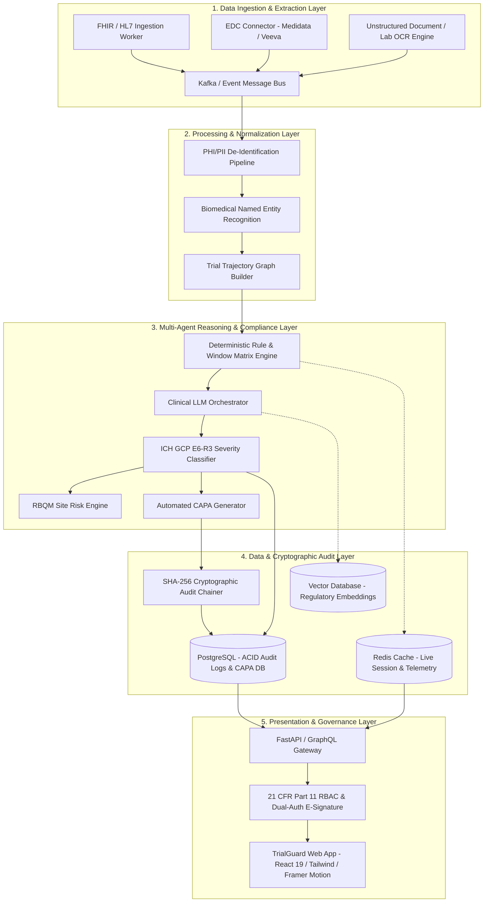
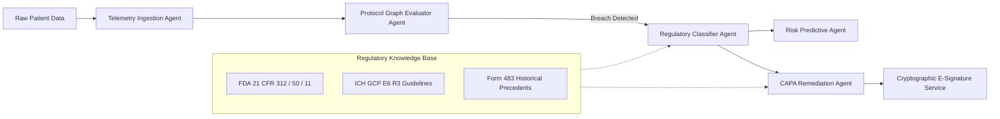
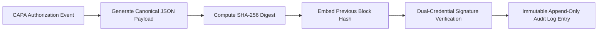
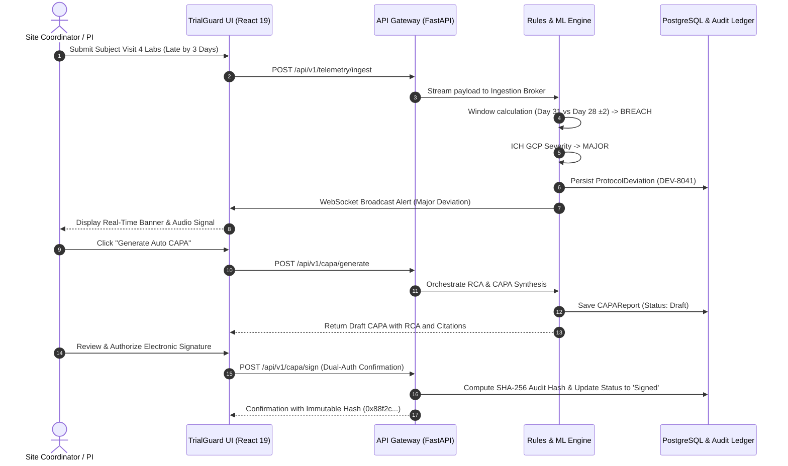

# System Architecture & Technical Specifications

> **Document ID:** TG-DOC-003  
> **Classification:** Technical Architecture & Engineering Design Document  
> **System Name:** TrialGuard AI — Autonomous Clinical Compliance Architecture  
> **Latency SLA:** < 700ms End-to-End Pipeline Execution  
> **Compliance Standards:** FDA 21 CFR Part 11, ICH GCP E6(R3), HIPAA Security Rule, SOC 2 Type II

---

## High-Level System Architecture

TrialGuard AI is engineered as a high-throughput, fault-tolerant, micro-service architecture capable of processing continuous patient telemetry streams and executing regulatory compliance logic with deterministic precision.



---

## End-to-End Latency Budget

To maintain real-time situational awareness across hundreds of investigative trial sites, TrialGuard AI enforces strict sub-second performance budgets across every execution stage:

```mermaid
gantt
    title End-to-End Compliance Pipeline Execution Budget (Total: ~665ms)
    dateFormat  X
    axisFormat %s ms

    section Ingestion & Normalize
    Patient Telemetry Ingestion       :0, 15
    Stream Pipeline & Hashing         :15, 39
    Biomedical NLP & De-Identification:39, 149

    section Compliance & Logic
    Deterministic Protocol Matrix     :149, 157
    ICH GCP Severity Taxonomy         :157, 171
    Site Risk Index Vectoring         :171, 189

    section Remediation
    CAPA Draft & Root Cause Synthesis :189, 639
    Client Notification & UI Render   :639, 665
```



| Pipeline Component | Dedicated Latency Budget | Underlying Technology | Primary Function |
| :--- | :--- | :--- | :--- |
| **Node 1: Patient Data Source** | `< 15ms` | FHIR v4.0 / CDISC ODM APIs | Telemetry capture from EHR, EDC, or eCOA |
| **Node 2: Data Ingestion Pipeline** | `24ms` | Async Event Bus (Kafka / Redis Stream) | In-memory message validation & payload hashing |
| **Node 3: Biomedical NLP Worker** | `110ms` | Fine-tuned Biomedical Transformer | Extracts entities, medication dosages, lab limits |
| **Node 4: Rule & Window Engine** | `8ms` | Deterministic Directed Graph Traversal | Compares visit timestamps to Schedule of Activities |
| **Node 5: GCP Severity Classifier** | `14ms` | Regulatory Rule Matrix + Embedding Search | Categorizes Minor / Major / Critical with FDA citations |
| **Node 6: Predictive Risk Engine** | `18ms` | Weighted Vector Calculation | Updates site risk index & subject compliance index |
| **Node 7: CAPA Generator** | `450ms` | Orchestrated Multi-Agent Clinical LLM | Synthesizes RCA, corrective steps, preventive actions |
| **Node 8: Dashboard Delivery** | `< 25ms` | WebSockets / React 19 Concurrent UI | Real-time browser updates and interactive rendering |
| **TOTAL PIPELINE LATENCY** | **~664ms** | **Sub-700ms Guaranteed SLA** | **Real-time autonomous compliance** |

---

## Multi-Agent AI & Reasoning Orchestration

TrialGuard AI avoids single-point hallucinations by distributing reasoning across specialized, decoupled autonomous agents:



1. **Telemetry Ingestion Agent:**
   - Performs HIPAA-compliant de-identification on the fly.
   - Extracts clinical entities (medications, dose units, lab ranges, timestamps) from unstructured clinician text and scanned documents.
2. **Protocol Graph Evaluator Agent:**
   - Models trial protocols as formal directed acyclic graphs (DAGs) representing the **Schedule of Activities (SoA)**.
   - Executes deterministic window checks (e.g., evaluating whether an encounter on day 31 violates a `Day 28 ± 2` constraint).
3. **Regulatory Classifier Agent:**
   - References vector embeddings of FDA 21 CFR guidelines and ICH GCP E6(R3) taxonomy.
   - Assigns severity scores (Minor, Major, Critical) and provides exact statutory citations.
4. **Predictive Risk Agent:**
   - Updates site and subject risk vectors dynamically, recalculating compliance percentages and risk heatmaps.
5. **CAPA Remediation Agent:**
   - Synthesizes root cause analyses based on historical deviation patterns.
   - Formulates precise, actionable corrective and preventive steps.
   - Triggers the cryptographic audit hashing pipeline.

---

## Data Models & Schema Definitions

The platform enforces strict typing and validation across all domain entities.

### 1. Site Record Schema (`SiteRecord`)
```typescript
interface SiteRecord {
  id: string;               // e.g. "S-104"
  name: string;             // e.g. "Boston Medical Center"
  city: string;             // e.g. "Boston"
  country: string;          // e.g. "US"
  region: string;           // e.g. "US East"
  subjects: number;         // Active enrolled subjects
  compliance: number;       // Compliance percentage (e.g. 94.2)
  risk: 'Low' | 'Medium' | 'High';
  status: 'Compliant' | 'Warning' | 'Critical';
  pi: string;               // Principal Investigator name
  lastVisit: string;        // ISO date string "YYYY-MM-DD"
}
```

### 2. Protocol Deviation Schema (`ProtocolDeviation`)
```typescript
interface ProtocolDeviation {
  id: string;               // Unique ID, e.g. "DEV-8041"
  site: string;             // Site reference, e.g. "S-104"
  siteName: string;         // e.g. "Boston Medical Center"
  trial: string;            // Protocol code, e.g. "ONC-402"
  patient: string;          // Subject ID, e.g. "SUBJ-4091"
  deviation: string;        // Description of deviation
  category: 'Visit Window' | 'Documentation' | 'Eligibility' | 'eCOA Compliance' | 'Consent' | 'Dosage';
  severity: 'Minor' | 'Major' | 'Critical';
  date: string;             // Timestamp "YYYY-MM-DD HH:mm"
  status: 'Open' | 'In Review' | 'Resolved';
  riskScore: number;        // Float 0.0 - 10.0
  rootCause: string;        // RCA summary
  corrective: string;       // Immediate action
  preventive: string;       // Long-term mitigation
  citation: string;         // e.g. "FDA 21 CFR 312.60 & ICH GCP E6(R3) 4.5.2"
  assignee: string;         // Assigned CRA or Monitor
}
```

### 3. CAPA Report Schema (`CAPAReport`)
```typescript
interface CAPAReport {
  id: string;               // e.g. "CAPA-2041"
  devId: string;            // Linked deviation ID, e.g. "DEV-8043"
  site: string;             // Site code
  trial: string;            // Trial protocol code
  subject: string;          // Subject identifier
  severity: 'Minor' | 'Major' | 'Critical';
  status: 'Draft' | 'In Review' | 'Signed' | 'Filed';
  created: string;          // Creation date "YYYY-MM-DD"
  signed: string | null;    // Signature timestamp or null
  signedBy: string | null;  // Authorized PI or monitor name
  regCitation: string;      // Legal / statutory citation
  rootCause: string;        // Synthesized root cause analysis
  corrective: string;       // Corrective action plan
  preventive: string;       // Preventive action plan
  hash: string | null;      // SHA-256 cryptographic audit hash
}
```

---

## Security, Cryptography & 21 CFR Part 11 Compliance



### 1. Cryptographic Audit Trail Chaining
Every deviation identification, status modification, and CAPA approval generates an immutable audit record hashed using **SHA-256**. The hash is calculated over:
```text
hash = SHA256(RecordID + Timestamp + UserID + ActionType + PayloadJSON + PreviousRecordHash)
```
This guarantees mathematical tamper evidence: any retroactive modification of historical trial logs invalidates downstream hashes, making unauthorized tampering immediately detectable during regulatory audits.

### 2. 21 CFR Part 11 Electronic Signature Implementation
Under FDA regulations, electronic signatures must:
- Be verified by two distinct identification components (user authentication session + explicit signing password / secondary confirmation).
- Explicitly display the printed name of the signer, the date and time, and the meaning associated with the signature (e.g., *"Approval and Regulatory Filing"*).
- Be permanently linked to the record so that they cannot be removed, copied, or transferred.

### 3. Role-Based Access Control (RBAC) Matrix

| User Role | View Telemetry | Triage Deviations | Generate CAPAs | Sign & File CAPAs | Modify Settings |
| :--- | :---: | :---: | :---: | :---: | :---: |
| **System Administrator** | Yes | Yes | Yes | Yes | Yes |
| **Lead CRA / Monitor** | Yes | Yes | Yes | Yes | No |
| **Principal Investigator (PI)** | Yes | Yes | Yes | Yes (Site Only) | No |
| **Clinical Researcher** | Yes | View Only | Draft Only | No | No |
| **Auditor / Regulatory Inspector** | Read Only | Read Only | Read Only | Read Only | No |

---

## Detailed Sequence Diagram: Real-Time Remediation Flow


