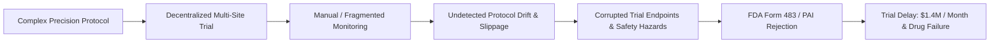
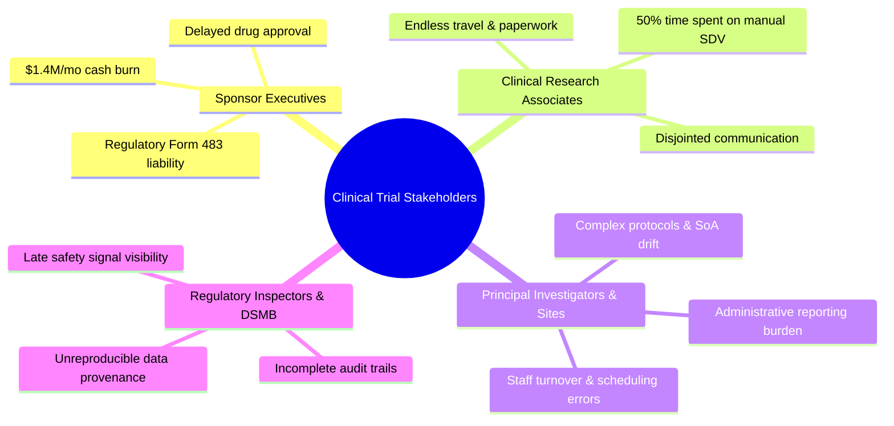

# Problem Statement: The Clinical Trial Compliance Crisis

> **Document ID:** TG-DOC-001  
> **Classification:** Regulatory & Clinical Research Strategy  
> **Target Audience:** Clinical Trial Sponsors, CRO Executives, Principal Investigators, Regulatory Affairs, Software Engineers  
> **Standard References:** FDA 21 CFR Parts 11, 50, 312; ICH GCP E6(R2) & E6(R3); EMA Reflection Paper on GCP Inspection Readiness

---

## Executive Summary

Bringing a novel therapeutic drug or biologic from preclinical discovery to market authorization currently costs an average of **$2.6 billion** and spans **10 to 12 years**. More than **80% of clinical trials experience significant operational delays**, with protocol non-compliance, unmonitored deviation drift, and delayed adverse event reporting accounting for the majority of costly setbacks.

Under legacy clinical trial operations, monitoring relies on post-hoc, manual, on-site audits conducted by Clinical Research Associates (CRAs) weeks or months after patient encounters occur. By the time a critical protocol deviation or safety signal is identified:
- Subject safety may have been compromised.
- Statistical endpoints may be corrupted or uninterpretable.
- Millions of dollars in remedial site visits and data re-verification are consumed.
- Regulatory submissions (NDA/BLA) face catastrophic rejection, complete response letters (CRLs), or FDA Form 483 inspection observations.

**TrialGuard AI** addresses this systemic vulnerability by replacing reactive, periodic monitoring with an **autonomous, continuous, real-time protocol compliance and deviation intelligence platform**.

---

## The $2.6B Clinical Trial Failure Mode

The pharmaceutical and biotechnology development pipeline suffers from high attrition and cost escalation driven by systemic operational flaws.

### Key Industry Statistics

| Metric | Industry Baseline | Source / Impact |
| :--- | :--- | :--- |
| **Average Cost per New Drug** | $2.6 Billion | Tufts Center for the Study of Drug Development |
| **Trials Delayed by Protocol Deviations** | 80%+ | CenterWatch / WCG Clinical Reports |
| **Manual Log & EDC Error Rate** | 34% | Society for Clinical Data Management (SCDM) |
| **Trials Experiencing Unmonitored Drift** | 68% | FDA Bioresearch Monitoring (BIMO) Metrics |
| **Monthly Delay Cost (Lost Exclusivity)** | $1.4 Million / month | Tufts CSDD Commercial Impact Analysis |
| **Increased Safety Hazard from Delayed AEs** | 4.2x | Applied Clinical Trials Safety Benchmark |
| **Average Time to Discover Protocol Breach** | 32 to 60 days | Legacy On-Site Monitoring Cycle |

---

## Core Problem Dimensions

### 1. Paper Logs & Disconnected EDC Systems (Data Silos)
Clinical trials are run across dozens or hundreds of global investigative sites. Each investigative site operates its own localized Electronic Health Record (EHR) systems (e.g., Epic, Cerner), physical binders, paper source logs, and disparate Electronic Data Capture (EDC) systems (e.g., Medidata Rave, Veeva Vault CDMS).

- **Transcription Lag:** Data entered into paper source documents or patient charts is manually transcribed into the sponsor's EDC system weeks after the subject visit.
- **Source Data Verification (SDV) Bottleneck:** CRAs travel physically to sites to verify paper charts against electronic logs line-by-line, consuming up to 50% of the entire trial monitoring budget.
- **Data Fragmentation:** Crucial patient context (such as vital sign trends, concomitant medications, and biomarker assay timestamps) remains isolated in disparate silos, preventing cross-site correlation.

### 2. Protocol Drift & Window Slippage
Modern clinical trials—particularly in oncology, immunology, and gene therapy—involve highly complex **Schedules of Activities (SoA)**. Patients must undergo laboratory assays, specimen draws, imaging scans, and dosage titrations within strict mathematical visit windows (e.g., `Visit 4: Day 28 ± 2 days`).

- **Schedule Slippage:** A laboratory visit delayed by 72 hours due to a site coordinator scheduling conflict often invalidates pharmacokinetic (PK) and pharmacodynamic (PD) profiles.
- **Compounding Deviation Drift:** When a minor window deviation goes unnoticed, subsequent visits are scheduled off-cadence, causing progressive protocol drift across entire cohorts.
- **Eligibility Creep:** Subjects who slightly breach secondary inclusion/exclusion criteria (e.g., elevated serum creatinine or marginal blood pressure) are enrolled by site staff under operational pressure, creating severe regulatory exposure.

### 3. Safety Signal Latency & Patient Risk
Subject safety is the cardinal principle of Good Clinical Practice (GCP). Under FDA 21 CFR 312.32 and international pharmacovigilance mandates:
- Serious Adverse Events (SAEs) that are fatal or life-threatening must be reported to health authorities within **7 calendar days**.
- Other unexpected serious suspected adverse reactions must be reported within **15 calendar days**.

In legacy workflows:
- Early signals of toxicity and adverse events are frequently recorded only as informal narrative notes in clinical charts.
- Aggregate safety reviews occur at quarterly intervals during Data Safety Monitoring Board (DSMB) meetings.
- Unmonitored dose escalations or undetected concomitant medication contraindications subject vulnerable patients to preventable clinical risks.

### 4. Delayed Audits & Crisis Remediation
Under the traditional paradigm, protocol non-compliance is uncovered during high-stakes **FDA Pre-Approval Inspections (PAI)** or sponsor internal audits:
- **FDA Form 483 Observations:** Inspectors cite failure to follow the investigational plan, failure to maintain adequate case histories, or lack of investigator oversight.
- **Warning Letters & Clinical Holds:** Serious findings jeopardize the validity of entire clinical datasets, forcing sponsors to repeat study arms or discard entire patient cohorts.
- **Financial & Competitive Ruin:** A six-month delay in drug commercialization can cost an enterprise hundreds of millions in patent exclusivity, while competitors capture market share.

### 5. Regulatory Modernization Demands: ICH GCP E6(R3)
The International Council for Harmonisation (ICH) has overhauled clinical trial governance with **ICH GCP E6(R3)**, explicitly mandating:
- **Risk-Based Quality Management (RBQM):** Sponsors must prioritize critical-to-quality factors rather than treating all trial data with uniform manual scrutiny.
- **Centralized & Digital Monitoring:** Regulators expect continuous, data-driven statistical anomaly detection rather than relying exclusively on periodic on-site visits.
- **Governance & Audit Trails:** Every automated insight, deviation flag, and corrective action must possess an immutable, time-stamped digital trail compliant with **FDA 21 CFR Part 11**.

Most life sciences organizations lack the software infrastructure to execute continuous, automated compliance at scale, remaining trapped in obsolete spreadsheets and retrospective audits.

---

## Stakeholder Pain Points

### Summary of Stakeholder Impacts

1. **Trial Sponsors (Pharma & Biotech):**
   - High risk of trial failure due to protocol violations that could have been prevented.
   - Skyrocketing monitoring costs with poor visibility into global multi-site performance.
2. **Contract Research Organizations (CROs):**
   - Strained CRA capacity; manual audits cause monitor burnout and high turnover.
   - SLA penalties from sponsors when monitoring visits miss critical deviations.
3. **Principal Investigators (PIs) & Study Coordinators:**
   - Overwhelming administrative burden balancing patient care with intricate protocol forms.
   - Lack of real-time warnings when scheduling visits or prescribing concomitant medications.
4. **Trial Subjects (Patients):**
   - Safety compromised by delayed detection of adverse reactions or dosage toxicity.
   - Risk of their trial contributions being discarded due to protocol invalidation.

---

## The Solution Imperative

To overcome these failure modes, modern clinical research requires an autonomous intelligence platform capable of:
1. **Sub-second Ingestion:** Standardizing multimodal telemetry directly from EHRs, EDCs, and lab systems.
2. **Zero-Latency Evaluation:** Comparing patient timelines against digital protocol graphs in real time.
3. **ICH GCP E6(R3) Classification:** Instantly triaging deviations into Minor, Major, and Critical risk tiers.
4. **Predictive Site Vectoring:** Identifying at-risk sites before compliance drift escalates.
5. **Closed-Loop Remediation:** Generating 21 CFR Part 11 compliant CAPAs with cryptographic audit proofs in under 60 seconds.

**TrialGuard AI was engineered to fulfill this imperative.**
