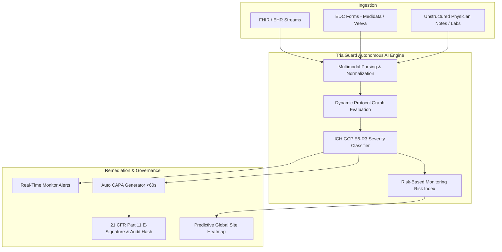
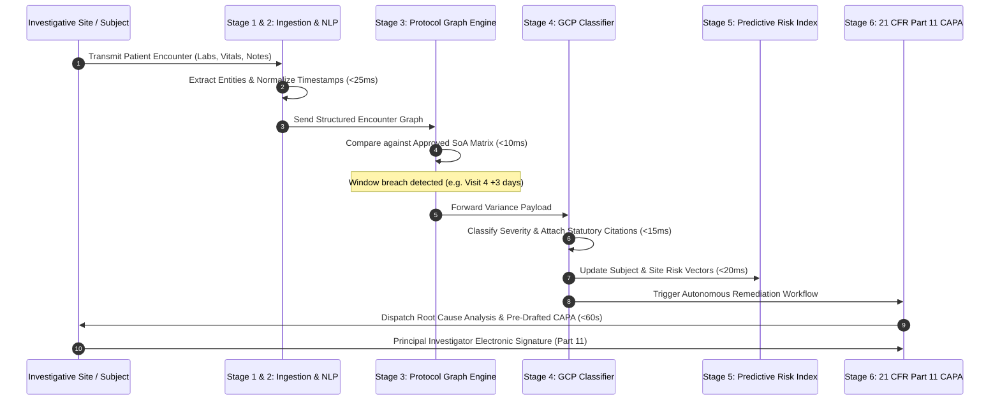
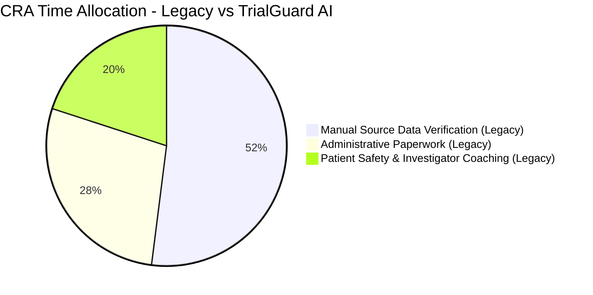
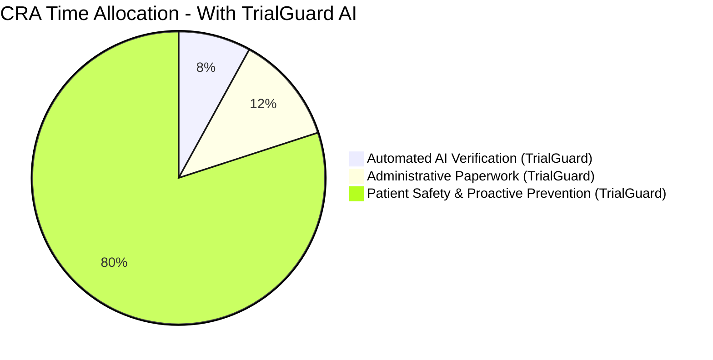

# Solution Overview: TrialGuard AI

> **Document ID:** TG-DOC-002  
> **Classification:** Platform Product & Solution Specification  
> **Product Name:** TrialGuard AI — Autonomous Clinical Trial Compliance Platform  
> **Core Motto:** *"AI That Detects Clinical Trial Deviations Before Regulators Do"*  
> **Regulatory Benchmarks:** FDA 21 CFR Part 11, 50, 312; ICH GCP E6(R3); HIPAA Security Rule; SOC 2 Type II

---

## Executive Summary

**TrialGuard AI** is an enterprise clinical intelligence platform that replaces slow, manual, retrospective clinical trial monitoring with an **autonomous, continuous, closed-loop compliance system**. 

By orchestrating multimodal biomedical ingestion, deterministic protocol graph evaluation, deep clinical natural language processing (NLP), and regulatory taxonomy classifiers, TrialGuard AI monitors patient encounters in real time. It flags protocol deviations instantly, stratifies multi-site trial risk, and automatically drafts **FDA 21 CFR Part 11-compliant Corrective and Preventive Action (CAPA)** reports with complete cryptographic audit provenance in under 60 seconds.

---

## The 6-Stage Autonomous Compliance Pipeline

At the heart of TrialGuard AI is a continuous pipeline operating across six orchestrated stages:

### Stage 1: Patient Visit & Telemetry Capture
- **Universal Ingestion:** Ingests live patient encounter streams via HL7 FHIR APIs, CDISC ODM standard formats, EDC webhooks (Medidata Rave, Veeva Vault CDMS), eCOA patient diaries, and digital lab results.
- **Multimodal Source Handling:** Seamlessly processes structured electronic data alongside unstructured clinician progress notes and scanned lab PDF reports.

### Stage 2: AI Ingestion & Biomedical NLP Normalization
- **Clinical Language Model:** Utilizes fine-tuned biomedical NLP to parse complex clinical acronyms, dosage titrations, visit timestamp logs, and biomarker lab assays.
- **Data Harmonization:** Converts disparate hospital formatting into unified digital trial graphs with zero manual transcription delay.

### Stage 3: Dynamic Protocol Graph Comparison
- **Schedule of Activities (SoA) Matrix:** Models the approved clinical trial protocol as a directed constraint graph.
- **Deterministic Rule Verification:** Sub-second evaluation checks:
  - Visit window boundaries (e.g., Target Day 28 ± 2 days).
  - Washout periods and dosage escalation sequences.
  - Secondary inclusion/exclusion parameter thresholds (e.g., serum creatinine, ANC, ALT/AST ratios).

### Stage 4: GCP Regulatory Taxonomy Classification
- **ICH GCP E6(R3) Modernization:** Automatically categorizes detected variances into **Minor**, **Major**, or **Critical** non-compliance tiers.
- **Automated Statutory Citations:** Immediately attaches exact regulatory references:
  - *FDA 21 CFR 312.60* (General responsibilities of investigators)
  - *FDA 21 CFR 312.32* (IND safety reporting)
  - *FDA 21 CFR 50.25* (Informed consent requirements)
  - *ICH GCP E6(R3) Section 4.5* (Compliance with protocol)

### Stage 5: Predictive Site Risk Scoring (RBQM)
- **Multi-Factor Risk Algorithm:** Synthesizes patient-level deviations, historical site performance, investigator turnover, and data entry latency into a live **Site Risk Index (0-100)**.
- **Proactive Anomaly Alerts:** Flags operational warning signs (e.g., a site trending from Low to High risk) weeks before protocol drift can corrupt clinical endpoints.

### Stage 6: Automated 21 CFR Part 11 CAPA Generation
- **Sub-60-Second Turnaround:** Automatically generates a comprehensive Corrective and Preventive Action (CAPA) document.
- **Structured Root Cause Analysis (RCA):** Identifies immediate failure mechanisms and formulates tailored preventive protocols.
- **Cryptographic Provenance:** Generates a unique **SHA-256 audit hash** verifying data immutability.
- **Regulatory E-Signatures:** Compliant electronic signature authorization workflow for Principal Investigators and Lead CRAs.

---

## Core Application Modules & User Capabilities

| Module | Primary Function | Key Features |
| :--- | :--- | :--- |
| **Command Dashboard** | High-level clinical overview | Real-time compliance score (97.4%), active site counts, open deviations ticker, inspection-readiness metric, and live activity feed. |
| **Patient Telemetry Hub** | Cohort and subject surveillance | Real-time vital signs (HR, BP, SpO2), adherence scoring, visit schedule countdowns, and protocol milestone trackers. |
| **AI Deviation Detection** | Intelligent deviation triage | Instant filtering by severity (Critical, Major, Minor), category (Visit Window, Consent, Eligibility, Dosage), and regulatory citation mapping. |
| **Site Risk Heatmap** | Global Risk-Based Monitoring (RBQM) | Interactive geographic site visualization, site risk categorization (Compliant, Warning, Critical), and PI oversight indices. |
| **CAPA Studio** | Closed-loop regulatory remediation | One-click CAPA generation, automated root-cause formulation, FDA citation linking, SHA-256 cryptographic audit stamping, and e-signature authorization. |
| **Analytics & Trends** | Predictive statistical intelligence | 6-month compliance trajectories, deviation category breakdown charts, automated vs. manual resolution speed comparisons. |
| **Enterprise Governance** | Regulatory security & RBAC | Role-based permission gating (Admin, CRA, PI, Auditor), 21 CFR Part 11 audit trails, theme customization, and API connectivity. |

---

## Quantifiable Impact: Before vs. After TrialGuard AI

### Business and Operational Transformation

| Operational Dimension | Legacy Clinical Operations | With TrialGuard AI | Quantifiable Gain |
| :--- | :--- | :--- | :--- |
| **Deviation Detection Time** | 30 to 60 days (post-visit audit) | **Under 700 milliseconds** | **99.9% faster** |
| **CAPA Generation & Filing** | 14 to 21 business days | **Under 60 seconds** | **98% time reduction** |
| **Data Transcription Errors** | 34% error rate in manual logs | **0% automated normalization** | **Eliminates transcription drift** |
| **Inspection Readiness** | Scrambled audit prep (weeks) | **Continuous 98.1% readiness** | **Always audit-ready** |
| **CRA Monitoring Costs** | ~$50,000 per site / year | **~$12,000 per site / year** | **76% operational savings** |
| **Trial Phase Delay Risk** | $1.4M / month lost exclusivity | **Zero unmonitored protocol drift** | **Saves $3.2M+ per Phase III** |

---

## Regulatory Compliance & Security Architecture

TrialGuard AI is architected from the ground up to satisfy the strictest international biotechnology regulations:

1. **FDA 21 CFR Part 11 (Electronic Records & Signatures):**
   - Computer-generated, time-stamped, immutable audit trails.
   - Dual-identification e-signature authorization for all CAPA approvals.
   - Cryptographic record hashing using standard SHA-256 verification.
2. **ICH GCP E6(R3) Governance:**
   - Native operationalization of Risk-Based Quality Management (RBQM).
   - Traceable documentation of root causes and preventative workflows.
3. **HIPAA & GDPR Privacy Compliance:**
   - Strict de-identification of Protected Health Information (PHI/PII) prior to ingestion.
   - Zero-retraining guarantee: Patient data is never ingested into public foundational LLMs.
4. **Data Security Standards:**
   - AES-256 encryption at rest; TLS 1.3 encryption in transit.
   - Strict Role-Based Access Control (RBAC) with granular permission levels.
